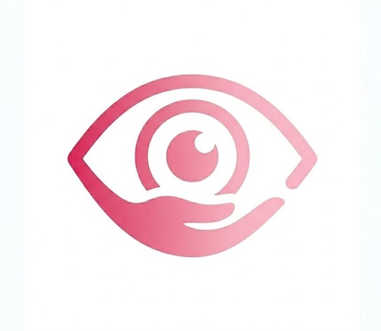

<p align="center">
  
</p>

<h1 align="center">BlindAid</h1>

<p align="center">
  <b>Real-time, fully offline object detection for visually impaired users</b><br/>
  100% on-device, zero internet required.
</p>


---
**BlindAid** is an android accessibility app that helps blind and visually impaired users understand their surroundings in real time. The phone's camera continuously scans the environment, detects nearby objects using a fine-tuned YOLOv8 model, and announces them through spoken audio including their relative position so users can move through the world more safely and independently.

Every part of the pipeline (capture →inference → and speech)  runs entirely on-device. No server, no network dependency, no compromise in areas with poor connectivity.

## Features

| | |
|---|---|
|  **Real-time detection** | Fine-tuned YOLOv8 model exported to TensorFlow Lite (float16) |
|  **Spoken audio guidance** | Native Android Text-to-Speech — fully eyes-free |
|  **Spatial awareness** | Announces objects in RT  |
|  **Fully offline** | Zero internet connectivity required, ever |
|  **Low-end device support** | Runs on entry-level Android hardware (tested on Android 10 Go) |
|  **Eyes-free control** | Start/stop detection via the physical volume button |
|  **Smart audio cooldown** | Suppresses repetitive announcements for unchanged objects |

## How It Works
Camera (CameraX) → Preprocessing → YOLOv8 (TFLite) → Position Mapping → Priority Filter → TTS Output

1. **Capture** — CameraX continuously streams frames, always processing only the most recent one to stay synced with the user's environment
2. **Detect** — Frames are resized, normalized, and run through the YOLOv8 model via TensorFlow Lite (GPU-accelerated, with automatic CPU fallback)
3. **Localize** — Each detection is mapped to a spatial zone — left, ahead, or right — based on its position in the frame
4. **Prioritize** — Safety-critical objects (people, vehicles, obstacles) are always announced first
5. **Speak** — A natural-language description is generated and spoken instantly through TTS

## Tech Stack

| Layer | Technology |
|---|---|
| Language | Kotlin |
| Camera | AndroidX CameraX |
| Detection model | YOLOv8 (fine-tuned), exported to TFLite float16 |
| Inference | TensorFlow Lite — GPU delegate, CPU fallback |
| Audio output | Android native TextToSpeech API |
| Min SDK | API 24 (Android 7.0) |

## Project Status

BlindAid is an actively developed prototype. Future work is focused on improving detection coverage and announcing multiple objects per cycle for richer situational awareness.
## Getting Started

```bash
git clone https://github.com/maryem1008/blindaid.git
```

Open the project in Android Studio, let Gradle sync, then build and run on a physical device or emulator with camera access enabled.

## Roadmap

- [ ] Expand training dataset with assistive-navigation-specific imagery
- [ ] Announce multiple detected objects per cycle
- [ ] Add distance estimation based on bounding box size
- [ ] Migrate to a larger model variant for improved recall

## License

Licensed under the [MIT License](LICENSE).

---

<p align="center">
  <i>Built to give a voice to what the eyes can't see.</i>
</p>
